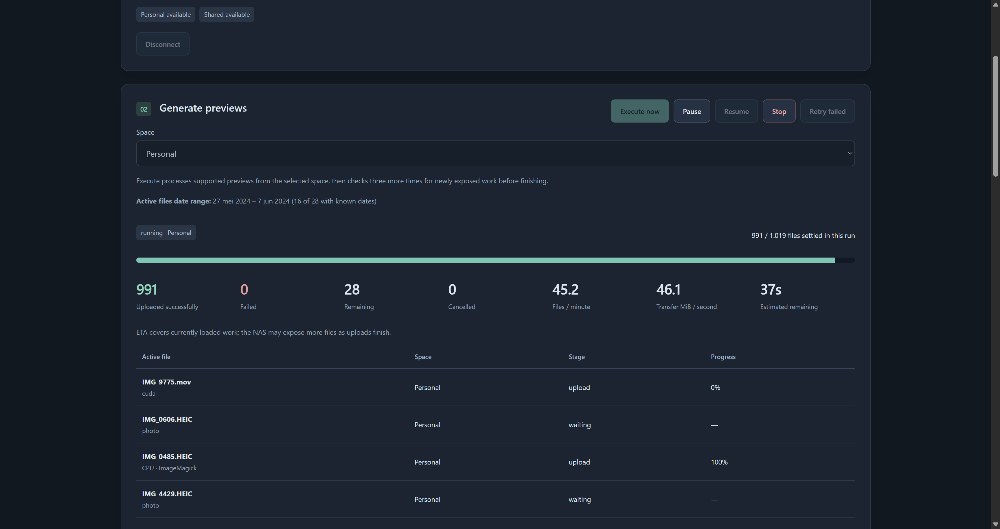

# Synology Preview Studio

Synology Preview Studio uses a Windows desktop to generate missing thumbnails and video previews for Synology Photos. It downloads only the media that Synology reports as needing conversion, processes it locally, uploads the generated previews, and removes the temporary files.

The application is useful when preview generation on the NAS is slow, incomplete, or unable to handle formats such as HEIC, HEVC, and HDR video efficiently.



> [!IMPORTANT]
> This project uses Synology Photos web APIs that Synology does not publicly document as a stable integration surface. DSM or Synology Photos updates may change their behavior.

## What it does

- Works with Personal Space, Shared Space, or both when the NAS advertises the required APIs.
- Generates three image thumbnails with ImageMagick.
- Extracts video thumbnails and, when requested by the NAS, generates a 720p H.264/AAC preview with FFmpeg.
- Caps generated video previews at 30 fps, avoiding unnecessary work for 60–240 fps camera footage.
- Uses NVIDIA decoding, scaling, and NVENC encoding when the media and installed FFmpeg build support it.
- Tone maps HDR10 and HLG video to BT.709 for compatible previews.
- Keeps download, image, video, and upload concurrency independent.
- Continually refills the work queue while current files are processing.
- Starts video work before photos so long MOV files are less likely to become the tail of a batch.
- Deduplicates NAS items within a run by space, unit ID, and component.
- Supports pause, resume, stop, failed-item retry, two-factor authentication, and live progress updates.

Original media is never modified. Generated previews are uploaded through Synology Photos' converted-file API.

## Requirements

- Windows 10 or Windows 11
- Node.js 24 or newer
- FFmpeg and FFprobe available on `PATH`, or their executable paths configured in the UI
- ImageMagick 7 with HEIC/HEIF reading support
- A Synology Photos account with access to the selected spaces
- A trusted HTTPS certificate when connecting to the NAS over HTTPS

An NVIDIA GPU is optional. Without NVENC, video encoding falls back to `libx264` on the CPU. HEIC support is still required even when a GPU is available.

The application checks FFmpeg, FFprobe, ImageMagick, HEIC support, NVENC, CUDA scaling, and HDR filters when it starts and whenever settings are saved.

## Install and run

From PowerShell in the project directory:

```powershell
npm install
npm run build
npm start
```

Open <http://127.0.0.1:4177>.

On Windows, `start.cmd` builds the interface before starting the server:

```powershell
.\start.cmd
```

Only one application server should run at a time. Performance settings apply to the next run. After updating the application, stop the server, run `npm install` and `npm run build`, then restart it; `start.cmd` performs the build step automatically.

`APP_PORT` overrides the default port of 4177. `APP_DATA_DIRECTORY` overrides the default `.data` directory for settings, history, and the default work directory. Set these environment variables before starting the server. For example:

```powershell
$env:APP_PORT = '4180'
$env:APP_DATA_DIRECTORY = 'D:\PreviewStudioData'
npm start
```

Open the address printed by the server. An explicitly configured **Temporary directory** takes precedence over the work directory under `APP_DATA_DIRECTORY`.

## Using the application

1. Enter the base NAS address, such as `https://nas.example.com:5001`. Do not include a path, query string, or credentials.
2. Enter the Synology username and password. If two-factor authentication is enabled, submit the current code when requested.
3. Select Personal Space, Shared Space, or both.
4. Click **Execute now**.
5. Leave the server running until the queue completes, or use **Pause** or **Stop**.

Pause prevents new downloads from starting, including files waiting for storage. Downloads already started can finish, and downloaded files can continue through conversion and upload. Stop cancels active work; previews whose uploads were already acknowledged remain on the NAS. The selected space is remembered when starting a normal run; unavailable spaces are disabled in the interface.

If the application or computer restarts, unfinished items can be returned by the NAS and processed again. Successfully acknowledged items normally disappear from the NAS work queue.

## How the queue works

Synology Photos exposes a conversion work queue, not a reliable backlog count or conventional paginated list. The application calls `list_convert_needed` for the Windows preview preset. Synology chooses which pending items to return and may return fewer items than the requested limit.

An empty conversion queue does not establish that every media file on disk has all previews. A filesystem scan for specific `@eaDir` filenames checks their existence and size; this application checks the work requested by Synology Photos for the signed-in account and selected space. Files absent from the Photos index, unsupported media, damaged originals, or an index that no longer reflects the preview files can require separate investigation. These are possible causes, not conclusions drawn from an empty queue. Inspect affected files in Photos and their cache directories before choosing a repair. Synology documents Photos-specific re-indexing under **Settings > Personal (or Shared Space) > Indexing > Re-index** in its [display troubleshooting guide](https://kb.synology.com/en-us/DSM/tutorial/What_can_I_do_if_photos_doesnt_show_items). Re-indexing is an investigation/recovery step and is not guaranteed to make every file appear in the desktop conversion queue.

An acknowledged preview upload normally causes Synology to remove that work from its pending set. An acknowledgment alone does not prove the requested previews are ready. Later queue requests can then expose more items. Consequently:

- The displayed total grows as new work becomes visible.
- There is no verified full-backlog number before processing.
- The application does not use an offset because affected Photos versions repeat items instead of returning a dependable next page.
- **Active files date range** shows the earliest and latest known media dates of the files currently waiting, downloading, converting, or uploading, matching the active-file table. It updates as files enter or leave that set and disappears when no files are active. Queued, completed, failed, and cancelled files do not contribute.
- Undated active files contribute no date. The interface reports partial date coverage or **Dates unavailable**; a one-day range displays one date. Dates use the browser's local timezone. Optional missing-date lookups cover newly discovered files in groups of up to 100, with up to four groups fetched in parallel, so files at the start of a large batch can also have dates without serial metadata requests delaying admission.
- A slow file can briefly be the only visible item. The application checks again every 500 ms and requests more work immediately when the last active file settles. Newly exposed work starts without another click. Final exhaustion still requires three fresh idle checks spaced at least two seconds apart; faster discovery does not shorten those intervals.
- Once all loaded work settles, three fresh checks spaced at least two seconds apart must discover no new supported items before the run finishes. The first check starts immediately, so final confirmation takes approximately four seconds plus NAS response time. Newly discovered work resets these checks; pause suspends them and resume restarts them.
- If the final check still lists a successfully uploaded file as needing previews, the run finishes with a warning containing its filename, NAS unit ID, and the preview types still requested. It is not converted repeatedly within that run. Executing again can return it because the NAS still considers it pending.
- While idle and connected, `/api/queue?library=personal` (or `shared` / `both`) inspects the pending batch without downloading, converting, or uploading media. This is useful for diagnosing files that return after an acknowledged upload.
- ETA covers currently discovered work. The NAS may expose more files after uploads finish, so ETA and totals can change during a run.

Items are deduplicated during a run using `space:unitId:component`. Identical filenames can still represent different NAS library items and are therefore processed separately.

An unsupported Live Photo video component is skipped with a warning and remains pending on the NAS. Supported files in the same response continue. Skipped components are counted separately and excluded from the supported-file total. A response containing only unsupported components explains the limitation without starting an empty run.

To exclude a specific item from future runs, add an entry to `.data/skipped-media.json`, an array of objects with `nasUrl`, `username`, and `key` (for example, `personal:28450:video`). The NAS URL and username must match the saved connection settings. These exclusions apply to initial work, queue refills, pending inspection, and Retry failed, and are read again on every queue request. Other files with the same filename, different IDs, or another space/account/NAS remain eligible. Remove the entry to allow the item again. Excluded items remain unchanged and pending on the NAS; run warnings identify them as skipped by the user.

Runs finish as `completed_with_errors` if files fail, components are skipped, fetching additional work fails, or temporary cleanup/history persistence reports a warning. Successful uploads remain successful. A failure to fetch additional work allows admitted files to finish; connect and execute again to fetch the remaining NAS work. Malformed queue responses and unknown media types remain compatibility errors.

## Video processing

For a video, Synology can request two different outputs:

- Still thumbnails, generated from an early video frame.
- A complete H.264 preview named `film_h264`, generated when the NAS reports `need_video`.

This is why some MOV files require decoding the whole video rather than extracting only one frame. Skipping the requested H.264 preview would leave the item in Synology's conversion queue.

The selected backend appears below each active filename:

- **NVIDIA decode / scale / encode**: the video stays on the GPU for the main pipeline.
- **nvenc** or **CPU decode · NVIDIA encode**: FFmpeg decodes or filters on the CPU and uses NVENC for H.264 encoding.
- **CPU · H.264**: FFmpeg uses `libx264`.

Rotated or HDR MOV files may still use substantial CPU time even when the UI shows NVENC. The installed FFmpeg build can use NVENC for encoding while rotation, HDR conversion, or tone mapping remains on the CPU. HDR frames are resized before the expensive floating-point tone map to reduce that cost.

The scheduler starts video items before photos and sorts by source size when Synology supplies it. This gives long videos more time to complete while photo workers remain busy.

## Performance settings

Open **Performance & tools** to change settings. Changes apply to the next run.

| Setting | Default | Purpose |
| --- | ---: | --- |
| Download workers | 4 | Concurrent original-media downloads |
| Image workers | 16 | Concurrent ImageMagick conversions |
| Video workers | 4 | Concurrent video conversions, up to 8 |
| Upload workers | 2 | Concurrent preview uploads |
| CPU threads per conversion | 2 | FFmpeg threads allocated to each CPU-assisted conversion |
| Video CQ | 23 | H.264 quality; lower values increase quality and output size |
| Keep free on disk | 10 GiB | Minimum free space preserved on the temporary drive |
| Staged storage limit | 20 GiB | Maximum temporary storage reserved by active files |

Good values depend on NAS bandwidth, disk speed, CPU, GPU, and media mix. Increase one limit at a time and watch files per minute rather than individual-file speed.

For a machine with many CPU cores and an NVIDIA GPU, start with:

- 6–8 download workers
- 16–24 image workers
- 4–8 video workers
- 2–4 upload workers
- 4 CPU threads per conversion

More video workers do not necessarily improve HDR throughput because several conversions can compete for CPU tone-mapping capacity. More download workers also divide the staged-storage budget into smaller reservations when Synology does not report a source size.

### Benchmarking

Run the included conversion benchmark with a generated PNG and a six-second H.264 video. Fixture generation and conversion run locally without downloading sample media:

```powershell
npm run benchmark
```

Or benchmark a folder containing both photos and videos:

```powershell
npm run benchmark -- "D:\path\to\media"
```

Results are written to `.benchmarks/latest.json`. The benchmark does not change application settings.

To compare video decoding and scaling pipelines using real media, pause the application and let admitted downloads, conversions, and uploads finish, then run:

```powershell
npm run benchmark:video -- "D:\path\to\videos"
```

This conversion-only benchmark accepts complete, unrotated SDR H.264/HEVC videos. It compares the current CUDA path, CUDA pixel formats and scaling algorithms, extra decoder frames, early frame-rate reduction, CUVID decoder resizing, and CPU decoding with CPU or GPU scaling. It also compares CUDA worker counts and mixed CPU/CUDA decoder pools. Tests retain the current preview dimensions, quality setting, frame-rate cap, and audio settings. Bilinear and decoder-integrated resizing can produce different image detail than the current bicubic scaler.

Each input contributes its first 30 seconds. Single-file measurements use three repetitions; batch measurements use two repetitions with four jobs per input. Results and exact commands are saved in `.benchmarks/video-pipeline/latest.json`. Shortlisted outputs are retained alongside the report and checked for dimensions, codec, frame rate, duration, and complete decoding. No media is uploaded and no application settings are changed. Resume the application when benchmarking finishes.

## Temporary storage

Temporary files use `.data/work` unless **Temporary directory** is configured. Each item receives an isolated directory that is deleted after upload, failure, or cancellation.

When Synology supplies a source size, the application reserves twice that size plus 128 MiB, with an additional 1 GiB for the ImageMagick disk cache when thumbnails are needed. If the size is absent, its reservation is the staged-storage budget divided among the configured download workers, with a minimum of 128 MiB plus that cache allowance. The application sets aside the cache and overhead before splitting the remaining allowance between original media and previews. Cache files use the item's temporary directory and are removed with it. These reservations can limit active files below the configured worker counts; thumbnail work requires a staged budget larger than 1 GiB.

Files waiting for storage reservations stay queued while admitted files finish downloading, converting, uploading, and cleaning up, even when those stages take longer than two minutes. Increasing the staged limit also increases each unknown-size file's reservation, so it does not by itself increase their concurrency. If no admitted files remain and available memory stays at or below 1 GiB for two minutes, waiting files fail with a memory-specific error.

If a download reveals that the original is larger than its estimated allowance, the app cleans up the attempt, releases its reservation, and automatically queues the same file with a larger reservation. A download's Content-Length supplies the size before writing oversized media; downloads without that header grow their estimate when they reach the allowance. The total staged budget and minimum free disk space still apply, so larger files can reduce concurrency. Files too large for the total staged budget fail with a storage-budget error.

If temporary cleanup fails, the affected filename appears in run warnings and its storage reservation remains held until final run cleanup succeeds. Once no admitted files can release storage, files blocked by these retained reservations fail with a cleanup-specific error so the run can finish and attempt final cleanup. Cleanup warnings do not undo acknowledged uploads. If final cleanup fails too, remove the leftover run directory after stopping the server and resolving any file locks.

If you see:

> Media exceeds its temporary-disk reservation.

increase **Staged storage limit**, reduce **Download workers**, or both. Also make sure the temporary drive has more free space than **Keep free on disk** plus the active reservations.

## Security and local data

- The web server listens only on `127.0.0.1`.
- State-changing requests require a per-process token and a permitted local origin.
- Redirects from the configured NAS address are disabled.
- Passwords, session IDs, device IDs, and Synology tokens remain in server memory and are cleared on logout or shutdown.
- The NAS address, username, preferences, and recent run summaries are stored under `.data`.
- Original media and generated previews exist temporarily under the configured work directory.

The runtime connects to the configured NAS. The default benchmark uses generated local fixtures. The optional real-media integration suite downloads the public libheif example HEIC image if it is not already cached under `.test-data/media`.

## Troubleshooting

### An original-media download is incomplete

The app retries interrupted original-media downloads up to three times. If the download still fails, the file's error reports the number of bytes received in the last attempt and the expected size when the NAS supplied it. Conversion and preview upload do not start for an incomplete download.

Try downloading the affected original directly from Synology Photos. If it also fails there, check the source file on the NAS and any reverse proxy serving Photos. Repeated failure at the same byte count is useful evidence, but does not by itself establish whether the source file or the connection is at fault. After resolving the download issue, use **Retry failed**. Restart the desktop server and reconnect after updating to receive the improved diagnostics.

### FFmpeg reports `Invalid color range` for a video

FFmpeg 7.0 can report this error when the video's color-space matrix is tagged as `reserved`. The failure happens before video filters run, so a color correction filter alone cannot fix it. The app now corrects this invalid H.264/HEVC tag in memory before decoding, for both thumbnails and video previews. It uses the advertised color primaries to choose the matrix when possible, otherwise marks it unspecified. Valid color-space tags, full/limited range, HDR transfer tags, and original files are preserved.

Restart the server after updating, reconnect, and use **Retry failed** if the failed run is still available, or **Execute now** in the affected space. After a restart, the NAS returns files whose previews are still missing.

### ImageMagick reports `cache resources exhausted`

Large photos can exceed ImageMagick's memory cache and require much slower temporary disk caching. The app now gives each image worker a safe share of installed RAM, while reserving half of usable memory for the rest of the pipeline and capping each ImageMagick memory resource at 1 GiB. It also allows up to 1 GiB of disk cache per thumbnail conversion, including memory-mapped files, and includes that allowance in its staged-storage reservation. Older versions fixed every worker's memory and map caches at 256 MiB and capped disk caching at 64 MiB, which could make high-resolution photos very slow or fail even with free RAM and disk space.

Restart the server after updating, then retry failed items. If the error persists, ensure the temporary drive has free space and reduce **Image workers** to reduce simultaneous memory use. Exceptionally large images or a stricter ImageMagick `policy.xml` may still exceed the cache limits.

### A MOV file takes a long time

Check the backend shown in the active-file table. `nvenc` confirms GPU encoding, but HDR tone mapping or rotation can still run on the CPU. Long, 4K, 60 fps, 10-bit, or HDR videos naturally take longer because Synology requested a complete video preview.

Video-first scheduling prevents these files from starting at the end of a newly exposed group. Photos continue on separate image workers whenever Synology has made them visible.

### The total stops with one or two MOV files remaining

The NAS may temporarily expose only those remaining items. The application polls every 500 ms and interrupts its polling delay when the last active file settles. When their uploads cause Synology to expose more work, the total increases and processing continues automatically.

### Two FFmpeg processes appear for one file

Chocolatey's `ffmpeg.exe` shim can appear as a parent process that launches the real FFmpeg executable. This is one conversion. Inside the application, a NAS item key is scheduled only once per run.

### An item appears to be processed again

An interrupted conversion or an upload without a confirmed acknowledgment remains pending on the NAS and can be returned after restart. The application deliberately retries it rather than assuming an incomplete preview is valid. Files with the same name but different Synology unit IDs are distinct items.

### NAS rejects a preview upload with code 108

Synology's common API code 108 means file upload failed; it does not identify the underlying cause. The app retries this response once with a short backoff, reopening the existing preview files without downloading or converting the original again. A second code 108 response remains a failed item. Permission and session errors are not retried this way, and Stop cancels the backoff. If it persists, check available space on the NAS and Synology Photos logs before using Retry failed. Successfully uploaded files remain successful.

### Shared Space is unavailable

The account needs Shared Space access, and the installed Synology Photos version must advertise the separate `SYNO.FotoTeam` download and converted-file APIs.

### HTTPS certificate is not trusted

Use a NAS hostname matching a certificate trusted by Node.js. Windows-installed private certificate authorities require Node's system-certificate option. Enable it before starting the application:

```powershell
$env:NODE_OPTIONS = (@($env:NODE_OPTIONS, '--use-system-ca') -join ' ').Trim()
npm start
```

Alternatively, provide an additional CA certificate file in PEM format:

```powershell
$env:NODE_EXTRA_CA_CERTS = 'D:\certificates\nas-ca.pem'
npm start
```

Restart the server after changing certificate options. The application retains TLS and hostname verification; it never disables certificate checking. See the [Node.js certificate options](https://nodejs.org/download/release/v24.11.1/docs/api/cli.html#--use-system-ca).

### Live Photo video components are skipped

Separate `live_video` conversion components are skipped because their download and upload contract has not been verified. Their count and filenames appear in run warnings. Regular photos and videos in the same batch continue through their verified routes. Skipped components remain pending on the NAS and are not included in **Retry failed**; that action retries supported files that failed.

## Development

Install the browser used by Playwright once after installing dependencies:

```powershell
npx playwright install chromium
```

```powershell
npm run check
npm test
npm run test:browser
npm run build
```

`npm run test:browser` builds the interface automatically before starting its isolated test server. Browser tests do not connect to your NAS.

For UI development, first build and start the backend in one terminal:

```powershell
npm run build
npm start
```

Then start Vite in a second terminal and open <http://127.0.0.1:5173>:

```powershell
npm run dev
```

The Vite proxy expects the backend at port 4177. Leave `APP_PORT` unset for this development setup; use port overrides with the built interface.

Run the optional real FFmpeg and ImageMagick integration tests from PowerShell with:

```powershell
$env:MEDIA_TESTS = '1'
npm test
Remove-Item Env:MEDIA_TESTS
```

This suite requires configured FFmpeg/ImageMagick tools and HEIC support. Its HEIC example is fetched from libheif's public repository on the first run; the other fixtures are generated locally.

The source layout is:

- `client/`: React interface
- `server/`: local server, Synology client, scheduler, and media conversion
- `shared/`: shared TypeScript types
- `scripts/`: fixture generation and benchmarks
- `test/`: unit, integration, and Playwright tests
